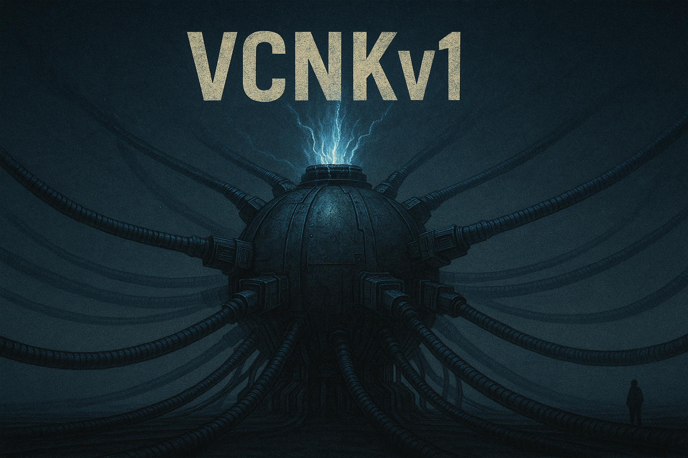

# Spectral


---
<p align="center">
    
</p>

15<sup>th</sup> Mar 2024 \
Prepared By: perrythepwner \
Challenge Author(s): **perrythepwner** \
Difficulty: <font color=green>Easy</font>

---

# TLDR
[...]

# Description
> [...] 

# Skills Required
- Basic understanding of Solidity and smart contracts
- Interaction with smart contracts
- [...]

# Skills Learned
- [...] 

# Challenge Scenario
[...]

# Analyzing the Source Code

## `Setup.sol`

```solidity
```

[...]

## `ChallengeName.sol`

```solidity
```

[...]

# Exploitation

[...]

see the full exploitation script [here](./htb/solver.py).

---
> `HTB{Pectra_UpGr4d3_c4uSed_4_sp3cTraL_bL@cK0Ut_1n_V0LnaYa}`
